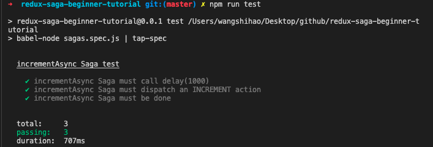

1. babel-node: command not found
@babel/node
The babel-node command in Babel 6 was part of the babel-cli package. In Babel 7, this command has been split out into its own @babel/node package, so if you are using that command, you'll want to add this new dependency.

2. Error: call: argument fn is undefined or null

Hi, @achillesoo7 Thanks for your reply. I figured it out myself
I was using
call(delay, timeout )
but it should be like
call( delay(timeout)) .

原因：下方函数没有导出
const delay = ms => new Promise(res => setTimeout(res, ms));





3. Error: put(channel, action): argument [object Object] is not a valid channel
``` js
	asserts.deepEqual(
		iterator.next(products).value,
		// put({ type: 'PRODUCTS_RECEIVED' }, products),
		put({ type: 'PRODUCTS_RECEIVED', products }),
		"fetchProducts should yield an Effect put({ type: 'PRODUCTS_RECEIVED', products })"
	);
```
It can happen when you confuse API from call and put => put(myAction, arg1, arg2) should instead be put(myAction(arg1,arg2)) (put the action and not the action creator).